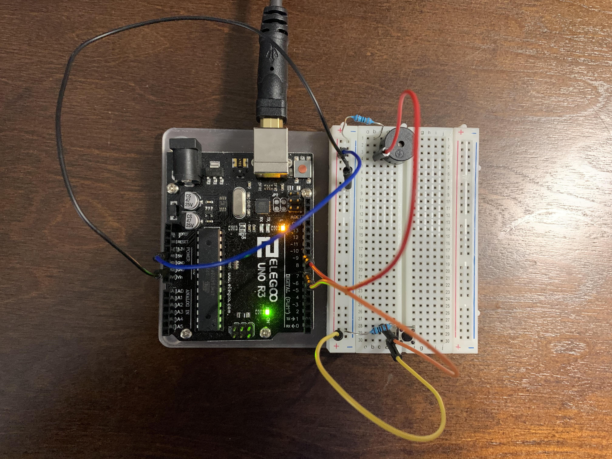

# Controlling a Piezo Buzzer with a Push Button Switch using Tinygo (https://tinygo.org/)

## Parts needed
  
  * Arduino Uno
  * USB A-B Calble
  * Breadboard
  * Piezo Buzzer
  * 330 Ohms & 1K Ohms resistor
  * Push Button Switch
  * Connecting Wires

## Connection Details 
  
  * Connect Power side of GND with Breadboard ground(-)
  * Connect Power side of 5V with Breadboard 5V(+)
  * Insert Piezo buzzer to the breadboard
  * Connect Piezo buzzer `-` leg with 330 Ohms resister
  * The other side of 330 Ohms resister goes to Breadboard Ground(-)
  * Connect Piezo buzzer `+` leg with PIN `9` Digital side
  * Connect a Push buttom switch in the Breadboard
  * Connect 1 leg of push buttom switch with Ground(-)
  * Connect abother leg of the switch with 5V via 1K Ohms resister
  * Connect same push button switch leg with PIN 7 of digital side

## Flash the Program to the board

```
$ tinygo flash -target arduino main.go
```
  
   